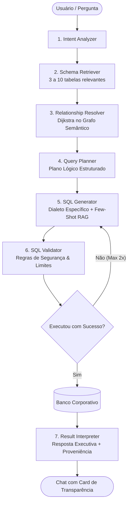
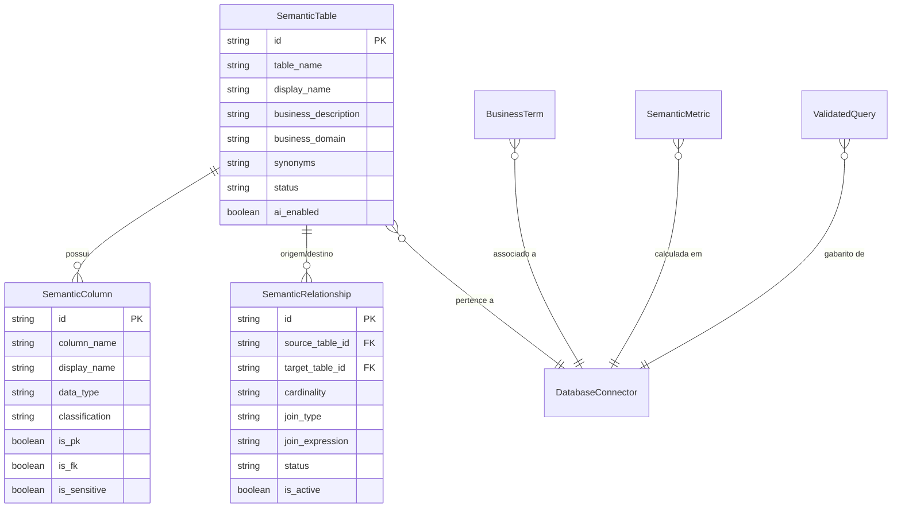

# Arquitetura Oráculo IA Versão 2: Camada Semântica & Mapa Visual de Relacionamentos

> **Documento Oficial de Arquitetura & Guia Operacional**  
> Plataforma: **Oráculo IA SPN**  
> Versão do Motor: **2.0.0 (Semantic Engine)**

---

## 1. Visão Geral & Princípio Fundamental

O objetivo da Versão 2 é erradicar alucinações na geração de SQL e interpretação de dados estruturados.

A premissa central é:
> **A LLM não deve ser responsável por "adivinhar o banco de dados".**  
> O sistema fornece um contexto enxuto, exato, semanticamente enriquecido e previamente validado por humanos através do **Mapa Visual de Dados**.



---

## 2. Pipeline Decomposto de Execução (NL2SQL v2)

| Etapa | Serviço (`apps/api/src/services/semantic/`) | Responsabilidade |
| :--- | :--- | :--- |
| **1. Intent Analyzer** | `IntentAnalyzer.ts` | Extrai a intenção (ranking, agregação, filtro, temporal), entidades mencionadas, KPIs e detecta ambiguidades. |
| **2. Schema Retriever** | `SchemaRetriever.ts` | Pontua e filtra apenas 3 a 10 tabelas estritamente relevantes, evitando poluir o contexto da LLM. |
| **3. Relationship Resolver** | `RelationshipGraphService.ts` | Navega o grafo em memória via Dijkstra para traçar o menor caminho entre tabelas, ignorando arestas desabilitadas. |
| **4. Query Planner** | `QueryPlanner.ts` | Monta o plano lógico agnóstico (`baseTable`, `joins`, dimensões, métricas e filtros). |
| **5. SQL Generator** | `SQLGenerator.ts` | Transforma o plano lógico em SQL no dialeto do conector (PostgreSQL, MySQL, SQL Server) com Few-Shot RAG. |
| **6. SQL Validator** | `SQLValidator.ts` | Quality gate que restringe comandos a `SELECT`/`WITH`, bloqueia DDL/DML destrutivo, veta produtos cartesianos e injeta limites de linhas. |
| **7. Result Interpreter** | `ResultInterpreter.ts` | Sintetiza a resposta executiva e constrói o payload de transparência ("Como cheguei nesta resposta?"). |

---

## 3. Modelo de Dados da Camada Semântica

A persistência é gerenciada via Prisma no Microsoft SQL Server (`apps/api/prisma/schema.prisma`):



---

## 4. Guia Operacional do Administrador

### 4.1 Sincronização do Schema Técnico
1. Acesse o menu **Configurações ➔ Inteligência Semântica (v2)**.
2. Na aba **Mapa de Dados**, selecione a fonte de dados e clique no botão **"Sincronizar Estrutura"**.
3. O sistema introspecta tabelas, colunas, tipos e Foreign Keys físicas.
4. **Princípio de Preservação:** Descrições empresariais, sinônimos e nomes amigáveis já editados pelo administrador **nunca são sobrescritos**.

### 4.2 Criação e Gestão de Relacionamentos no Canvas
1. No canvas interativo (`@xyflow/react`), localize as duas tabelas.
2. Clique no handle de conexão da coluna de origem e arraste até o handle da coluna de destino.
3. No modal que se abrirá, configure:
   - **Cardinalidade:** `1:1`, `1:N`, `N:1` ou `N:N`.
   - **Tipo do Relacionamento:** Chave Estrangeira Real, Lógico, Semântico ou Manual.
   - **JOIN Padrão:** `INNER JOIN` ou `LEFT JOIN`.
   - **Expressão do JOIN:** ex: `tb_vendas.cliente_id = tb_clientes.id`.
   - **Descrição de Negócio:** quando a IA deve utilizar este caminho relacional.
4. Clique em **Salvar Relacionamento**. O grafo em memória atualizará automaticamente as rotas para a IA.

### 4.3 Dicionário de Negócios & Métricas Homologadas
- **Dicionário de Negócios:** Mapeie sinônimos e regras (ex: "Faturamento" ➔ `SUM(valor_liquido)` com filtro padrão `status = 'FINALIZADA'`).
- **Métricas:** Formalize os KPIs da empresa (Ticket Médio, Ruptura, MTTR, Margem) para impedir que a LLM invente fórmulas.

### 4.4 Biblioteca de Consultas Homologadas (Few-Shot RAG)
- Cadastre perguntas comuns associadas à consulta SQL ideal validada pela equipe técnica.
- Durante a geração de novas consultas semelhantes, o `SQLGenerator` recupera estes gabaritos como Few-Shot dinâmico.

### 4.5 Laboratório & Diagnóstico
- **Laboratório:** Digite qualquer pergunta em linguagem natural para inspecionar em tempo real cada passo do pipeline semântico (intenção, tabelas, plano lógico, SQL e tempo).
- **Diagnóstico:** Acompanhe a cobertura semântica (%) do seu banco e aprove sugestões automáticas de novos relacionamentos identificados pela inteligência da plataforma.

---

## 5. Como Executar os Testes Automatizados

Para rodar a suíte de testes determinísticos do SQL Validator e dos algoritmos de menor caminho do Grafo:

```bash
node --import tsx/esm scripts/test-semantic-engine.ts
```

Resultado esperado:
```text
📊 Resultado dos Testes: 14 de 14 testes aprovados.
🎉 TODOS OS TESTES PASSARAM COM 100% DE SUCESSO!
```
